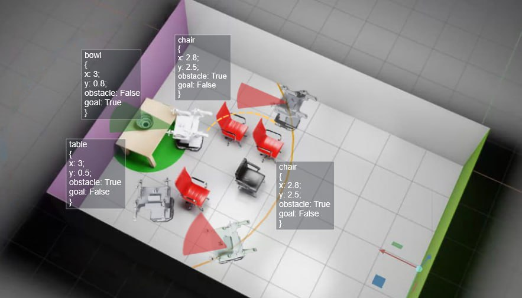

## Getting Started
The installation process fully complies with the official Isaac Lab documentation, with the exception that you need to clone the current pipeline, and not from the official Isaac Lab repository.

- [Installation steps](https://isaac-sim.github.io/IsaacLab/main/source/setup/installation/index.html#local-installation)
- [Reinforcement learning](https://isaac-sim.github.io/IsaacLab/main/source/overview/reinforcement-learning/rl_existing_scripts.html)
- [Tutorials](https://isaac-sim.github.io/IsaacLab/main/source/tutorials/index.html)

The launch is carried out in accordance with the official documentation. The name of the environment - Isaac-Aloha-Direct-v0
The SAC algorithm of the skrl library is used here.
## Installation, 
1. Execute all steps from official [installation instruction](https://isaac-sim.github.io/IsaacLab/main/source/setup/installation/binaries_installation.html), up until:
```
https://isaac-sim.github.io/IsaacLab/main/source/setup/installation/binaries_installation.html
```
2. Download all necessary data and assets:
```
https://drive.google.com/drive/folders/1sdWFHsREqW_2fmu2E2mjV8LxF6KUYaSe?usp=sharing
```
3. Put aloha_assets.zip and unzip it to IsaacLab/source/isaaclab_assets/data/

Asset directories should look like this by the path IsaacLab/source/isaaclab_assets/data/:
```
└── aloha_assets
    ├── aloha
    │   ├── aloha.usd
    │   └── realsense.usd
    ├── objects
    │   └── bowl.usd
    └── scenes
        ├── obstacles
        └── scenes_sber_kitchen_for_BBQ
            ├── kitchen_new_simple.usd
            └── table
```
4. Put "all_paths.json" to "IsaacLab/data/"
5. Put "text_embeddings.pt" to "IsaacLab/source/isaaclab_tasks/isaaclab_tasks/direct/aloha_nav/"
6. Replace the "skrl" folder on the "miniconda3/envs/env_isaaclab/lib/python3.10/site-packages/skrl" path with a folder from IsaacLab
After that, installation is successful.

## Usage examples
Train navigation:
```
./isaaclab.sh -p scripts/algos/run_sac.py
```

Imitation learning:
For IL firsly you should get paths:
```
./isaaclab.sh -p path_generator.py
```
To generate paths via dijkstra algo (Check, that there no all_paths.json in data):
```
./isaaclab.sh -p source/isaaclab_tasks/isaaclab_tasks/direct/aloha/path_generator.py 
```
